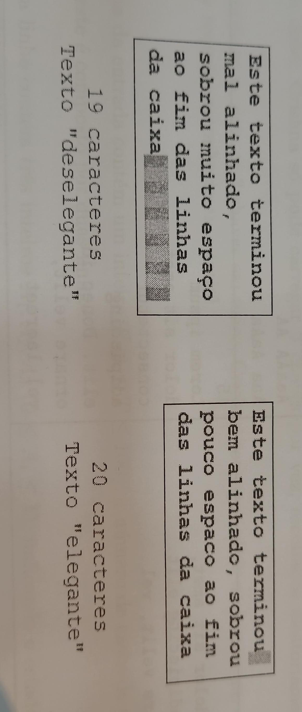

# Problema A - Apresentando o TCC

**Input file:** standard input  
**Output file:** standard output  
**Time limit:** 1 second  
**Memory limit:** 256 megabytes  

Depois de cinco anos de muito estresse e noites mal dormidas, Lucas finalmente vai apresentar seu TCC!  
Ele já finalizou o artigo e está preparando sua apresentação. No entanto, ao adicionar caixas de texto em seus slides, Lucas percebeu que restavam espaços ao final de cada linha. E o pior: o tamanho desses espaços variava!

Como ele detesta desalinhamentos, Lucas sempre tenta ajustar o comprimento da caixa de texto para minimizar o espaço restante ao final das linhas e deixar o texto mais *elegante* possível.

No exemplo acima, quando a caixa de texto tinha comprimento para 19 caracteres, restavam 11 espaços ao fim da última linha, tornando o texto desalinhado. No entanto, ao aumentar esse comprimento para 20 caracteres, o maior espaço ao final das linhas era de apenas 1, sendo essa a solução mais elegante possível.

A fonte utilizada é monoespaçada, ou seja, todos os caracteres ocupam o mesmo espaço. Nenhuma palavra pode ser cortada entre linhas. Lucas deseja encontrar o comprimento da caixa de texto que:

- Minimiza o **maior espaço restante** ao final das linhas;
- Em caso de empate, usa o **maior número de linhas** possível.

Além disso, o comprimento da caixa deve ser ao menos tão longo quanto a maior palavra do texto, e o texto deve conter pelo menos duas linhas.

## Input

- A primeira linha contém um inteiro `N (2 ≤ N ≤ 50)`, o número de palavras no texto.
- A segunda linha contém um texto contínuo com `N` palavras separadas por espaço.  
  Cada palavra é uma string de até 10 caracteres, formada por letras maiúsculas, minúsculas, vírgulas ou pontos finais (`A-Z`, `a-z`, `,`, `.`).  
  Nenhuma palavra contém espaços.

## Output

Na primeira linha, imprima o comprimento ideal da caixa de texto.

Nas linhas seguintes, imprima o texto original com as quebras de linha apropriadas.  
Não devem ser impressos caracteres de espaço ao final das linhas e nenhuma palavra pode ser cortada.

---

## Exemplos

<table style="width: 100%;">
  <tr>
    <th style="width: 50%;">Entrada</th>
    <th style="width: 50%;">Saída</th>
  </tr>
  <tr>
    <td>
      14 
      Este texto terminou bem alinhado, sobrou pouco espaco ao fim das linhas da caixa
    </td>
    <td>
      20 
      Este texto terminou 
      bem alinhado, sobrou 
      pouco espaco ao fim 
      das linhas da caixa
    </td>
  </tr>
  <tr>
    <td>
      6 
      Nao aguento mais escrever o TCC
    </td>
    <td>
      16 
      Nao aguento mais 
      escrever o TCC
    </td>
  </tr>
    <tr>
    <td>
      7 
      AaaAAAa Aa aAA AaaAA AA Aaa AaAA
    </td>
    <td>
      8 
      AaaAAAa 
      Aa aAA 
      AaaAA AA 
      Aaa AaAA
    </td>
  </tr>
    <tr>
    <td>
      14 
      Lorem ipsum dolor sit amet, consectetur adipiscing elit. Donec id ornare velit, vel laoreet.
    </td>
    <td>
      15 
      Lorem ipsum 
      dolor sit amet, 
      consectetur 
      adipiscing elit. 
      Donec id 
      ornare velit, 
      vel laoreet.
    </td>
  </tr>
</table>

