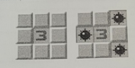

# Problema C - Campo Minado

**Input file:** standard input  
**Output file:** standard output  
**Time limit:** 1 second  
**Memory limit:** 256 megabytes  

João Gustavo é um grande fã do jogo Campo Minado. Quando era criança, passava horas jogando em seu computador. Hoje em dia, no entanto, ele percebe que poucas crianças conhecem esse clássico.

O jogo consiste em um campo quadriculado onde várias bombas estão escondidas. O objetivo é revelar as posições seguras e evitar as bombas. Ao clicar em uma célula do campo, o jogo mostra quantas bombas existem nas células adjacentes (inclusive nas diagonais).

Dado o estado inicial de um campo de Campo Minado, João gostaria de saber o que aconteceria ao clicar em determinadas coordenadas. Ele pode clicar em uma célula quantas vezes quiser, mesmo repetidamente. Se ele clicar em uma bomba, o jogo termina imediatamente.

## Input

A primeira linha contém três inteiros `L`, `C` e `T` (`1 ≤ L, C ≤ 100`, `1 ≤ T ≤ 10⁴`) — o número de linhas e colunas do campo minado, e o número de tentativas que João Gustavo fará.

As próximas `L` linhas contêm `C` caracteres cada uma, sem espaços. O caractere `#` representa uma bomba, enquanto o caractere `.` representa uma célula segura.

Em seguida, seguem `T` linhas, cada uma com dois inteiros `x` e `y` (`1 ≤ x ≤ L`, `1 ≤ y ≤ C`), indicando a linha e a coluna em que João clicará.

## Output

Para **cada tentativa** de Gustavo:

- Se ele clicar em uma bomba, imprima `voce perdeu` e termine o programa imediatamente, **sem** processar as próximas tentativas.
- Caso contrário, imprima um número entre `0` e `8`, representando quantas bombas existem nas células adjacentes (inclusive nas diagonais).

---

## Exemplos

<table style="width: 100%;">
  <tr>
    <th style="width: 50%;">Entrada</th>
    <th style="width: 50%;">Saída</th>
  </tr>
  <tr>
    <td>
      4 4 3 
      .##. 
      .#..# 
      .#..# 
      ##..# 
      1 2 
      3 1 
      4 3
    </td>
    <td>
      2 
      3 
      3
    </td>
  </tr>
  <tr>
    <td>
      3 5 6 
      .##.# 
      ..### 
      ...#. 
      2 2 
      3 1 
      3 4 
      3 3 
      3 1 
      1 4
    </td>
    <td>
      2 
      0 
      voce perdeu
    </td>
  </tr>
  <tr>
    <td>
      5 7 4 
      .##.... 
      ....... 
      #..#.## 
      #.#.#.. 
      #....#. 
      3 5 
      1 1 
      3 2 
      5 7
    </td>
    <td>
      4 
      1 
      3 
      2
    </td>
  </tr>
</table>
